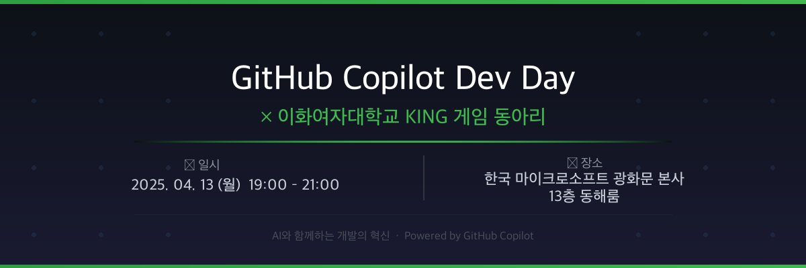

# 🎮 GitHub Copilot Dev Day × 이화여자대학교 KING 게임 동아리

---

> **AI와 함께하는 개발의 혁신, 이제 Copilot과 함께 합니다.**

GitHub Copilot은 전세계에서 가장 많은 개발자들이 사용하는 개발 파트너이자, AI 친화적인 툴로써 매일 매일 새로운 기능들이 업데이트 되고 있습니다.

대한민국 여성 개발자들의 큰 축을 차지하고 있는 **이화여자대학교 게임 동아리 KING** 학생들과 함께, MS MVP와 IT 전문가들이 Copilot · AI 개발에 있어 꿀팁들을 공유하는 자리를 마련합니다. 🍀

---

## 📅 행사 정보

| 항목 | 내용 |
|------|------|
| 📆 **일시** | 2025년 4월 13일 (월) 오후 7:00 ~ 9:00 |
| 📍 **장소** | 한국 마이크로소프트 광화문 본사 13층 동해룸 |
| 🎯 **대상** | 이화여자대학교 KING 게임 동아리 학생 |
| 🥪 **제공** | Microsoft가 후원하는 샌드위치 & 커피 |
| 💻 **준비물** | 노트북 또는 개인 기기 지참 권장 (워크샵 실습 위주 진행) |

---

## 🎤 발표자 & 세션

### 🥇 송용성 — Microsoft AI MVP · 순순팩토리 대표

> **"VS Code와 Copilot, 왜 써야 할까"

Microsoft AI MVP이자 순순팩토리 대표로, VS Code와 GitHub Copilot이 개발자의 생산성을 어떻게 바꾸는지, 실제 사용 경험을 바탕으로 생생하게 전달합니다.

---

### 🥈 채윤호 — 리니지 · 리니지 토너먼트 초기 개발자

> **"전설의 게임 기획자가 말아주는 AI 활용 비법"

리니지, 리니지 토너먼트 등 한국 게임 역사에 남을 타이틀들의 초기 개발자로서 직접 들려주는, 게임 개발 현장에서의 AI 활용 노하우와 인사이트를 공유합니다.

---

### 🥉 송요창 — 배달의민족 시니어 개발자
 
> **"현업에서 바라보는 VS Code 사용법과 취업에 도움되는 시크릿 꿀팁"**

배달의민족 시니어 개발자로 근무하며 쌓아온 실전 VS Code 활용법과, 취업을 앞둔 학생들을 위한 아무도 알려주지 않는 시크릿 꿀팁을 공개합니다.

---

### ✨ 특별 세션 — MS 현업 전문가와 함께 나누는 이야기
> *(참가자 미정)*

마이크로소프트 현업 전문가들이 직접 참여해 현장의 생생한 이야기와 Q&A를 나눕니다.

---

## 🗓️ 타임테이블

| 시간 | 내용 |
|------|------|
| 19:00 | 🚪 참가 등록 & 네트워킹 (샌드위치 & 커피) |
| 19:20 | 🎙️ 오프닝 & GitHub Copilot 소개 |
| 19:35 | 💬 세션 1 — 송용성: VS Code와 Copilot, 왜 써야 할까 |
| 20:00 | 💬 세션 2 — 채윤호: AI 활용 비법 |
| 20:25 | 💬 세션 3 — 송요창: VS Code 사용법 & 취업 꿀팁 |
| 20:50 | 💬 특별 세션 — MS 현업 전문가와의 대화 |
| 21:00 | 🎉 마무리 & 자유 네트워킹 |

---

## 🏫 대상 동아리 소개

**이화여자대학교 KING 게임 동아리**는 대한민국 여성 개발자 커뮤니티의 큰 축을 담당하는 게임 개발 동아리입니다. 게임 기획, 프로그래밍, 아트 등 다양한 분야의 인재들이 모여 실전 프로젝트를 함께 만들어가고 있습니다.

📸 **Instagram:** [@ewha_king](https://www.instagram.com/ewha_king/)

---

## 📍 오시는 길

**한국 마이크로소프트 광화문 본사 13층 동해룸**

- 🚇 지하철 5호선 광화문역 하차
- 🏢 서울특별시 종로구 세종대로 136 (파이낸스센터) 13층 동해룸

---

## 💾 당일 샘플 & 예제

> 🛠️ 행사 당일 사용될 샘플 코드 및 실습 예제들은 **이 저장소에 공유될 예정**입니다.
> 행사 전날까지 업데이트되니, Star ⭐ 를 눌러 알림을 받아보세요!

---

## 🌐 관련 링크

- [GitHub Copilot 공식 사이트](https://github.com/features/copilot)
- [GitHub Copilot Dev Days 글로벌 커뮤니티](https://github.com/github/GitHub-Copilot-Dev-Days)
- [VS Code 다운로드](https://code.visualstudio.com/)
- [이화여자대학교 KING 게임 동아리 Instagram](https://www.instagram.com/ewha_king/)

---

## 🤝 파트너

| | |
|:---:|:---:|
| **Microsoft Korea** | **이화여자대학교 KING 게임 동아리** |

---

**한국 여성 개발의 중심, 이화여자대학교 KING 게임 동아리와 함께합니다** 🎮

*Powered by [GitHub Copilot](https://github.com/features/copilot)*

